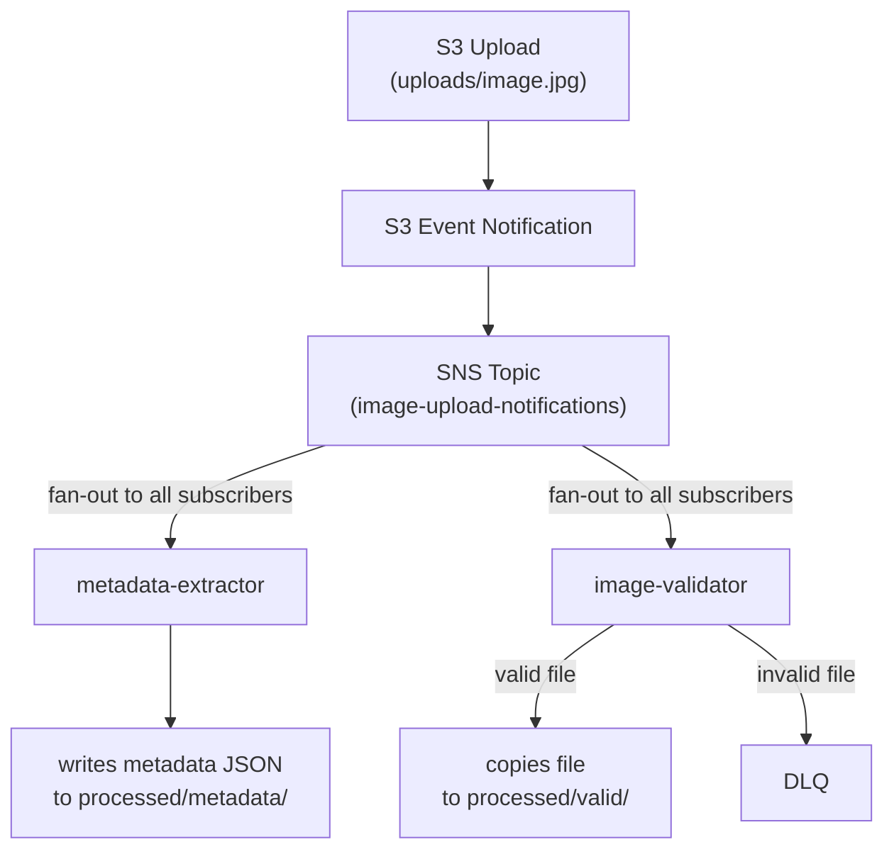

# SNS Topic Setup Guide

## Overview

Amazon SNS (Simple Notification Service) acts as the routing layer in your event-driven architecture. When images are uploaded to S3, S3 sends notifications to SNS, which then fans out to both Lambda functions. Unlike the previous assignment, there are **no filter policies** - both lambdas receive every event.

## Prerequisites

- S3 bucket created ([S3 Setup](./s3-setup.md))
- Lambda functions created ([Lambda Setup](./lambda-setup.md))
- AWS CLI installed and configured

## Step 1: Create SNS Topic

```bash
aws sns create-topic \
  --name image-upload-notifications \
  --region us-east-1
```

Save the Topic ARN from the output:
```json
{
    "TopicArn": "arn:aws:sns:us-east-1:<ACCOUNT_ID>:image-upload-notifications"
}
```

You can also retrieve it later:

```bash
aws sns list-topics --region us-east-1 --query 'Topics[?contains(TopicArn, `image-upload-notifications`)].TopicArn' --output text
```

## Step 2: Grant S3 Permission to Publish to SNS

Create a file named `sns-topic-policy.json` (replace `<AWS_ACCOUNT_ID>` and `<your-pitt-username>`):

```json
{
  "Version": "2012-10-17",
  "Statement": [
    {
      "Effect": "Allow",
      "Principal": {
        "Service": "s3.amazonaws.com"
      },
      "Action": "SNS:Publish",
      "Resource": "arn:aws:sns:us-east-1:<AWS_ACCOUNT_ID>:image-upload-notifications",
      "Condition": {
        "StringEquals": {
          "aws:SourceAccount": "<AWS_ACCOUNT_ID>"
        },
        "ArnLike": {
          "aws:SourceArn": "arn:aws:s3:::cc-images-<your-pitt-username>"
        }
      }
    }
  ]
}
```

Apply the policy:

```bash
aws sns set-topic-attributes \
  --topic-arn arn:aws:sns:us-east-1:<AWS_ACCOUNT_ID>:image-upload-notifications \
  --attribute-name Policy \
  --attribute-value file://sns-topic-policy.json \
  --region us-east-1
```

## Step 3: Subscribe Lambda Functions to SNS Topic

Both Lambda functions subscribe to the same topic with **no filter policies**. This is a fan-out pattern - every upload notification goes to both lambdas.

### Subscribe metadata-extractor

```bash
aws sns subscribe \
  --topic-arn arn:aws:sns:us-east-1:<AWS_ACCOUNT_ID>:image-upload-notifications \
  --protocol lambda \
  --notification-endpoint arn:aws:lambda:us-east-1:<AWS_ACCOUNT_ID>:function:metadata-extractor \
  --region us-east-1
```

### Subscribe image-validator

```bash
aws sns subscribe \
  --topic-arn arn:aws:sns:us-east-1:<AWS_ACCOUNT_ID>:image-upload-notifications \
  --protocol lambda \
  --notification-endpoint arn:aws:lambda:us-east-1:<AWS_ACCOUNT_ID>:function:image-validator \
  --region us-east-1
```

## Step 4: Verify Subscriptions

List all subscriptions to your topic:

```bash
aws sns list-subscriptions-by-topic \
  --topic-arn arn:aws:sns:us-east-1:<AWS_ACCOUNT_ID>:image-upload-notifications \
  --region us-east-1
```

You should see two subscriptions with status "Confirmed" (Lambda subscriptions auto-confirm).

## Step 5: Configure S3 Event Notifications

Now configure your S3 bucket to send notifications to SNS when objects are uploaded to the `uploads/` prefix.

Create a file named `s3-notification-config.json` (replace `<AWS_ACCOUNT_ID>`):

```json
{
  "TopicConfigurations": [
    {
      "TopicArn": "arn:aws:sns:us-east-1:<AWS_ACCOUNT_ID>:image-upload-notifications",
      "Events": ["s3:ObjectCreated:*"],
      "Filter": {
        "Key": {
          "FilterRules": [
            {
              "Name": "prefix",
              "Value": "uploads/"
            }
          ]
        }
      }
    }
  ]
}
```

Apply the notification configuration:

```bash
aws s3api put-bucket-notification-configuration \
  --bucket cc-images-<your-pitt-username> \
  --notification-configuration file://s3-notification-config.json \
  --region us-east-1
```

## Step 6: Verify S3 Event Notifications

Check that the notifications were configured:

```bash
aws s3api get-bucket-notification-configuration \
  --bucket cc-images-<your-pitt-username> \
  --region us-east-1
```

You should see a single TopicConfiguration for the `uploads/` prefix.

## Testing the Complete Flow

Test the entire event-driven architecture:

```bash
# upload a test image to the uploads/ prefix
aws s3 cp test-image.jpg s3://cc-images-<your-pitt-username>/uploads/test-image.jpg

# wait ~15 seconds, then check processed output in S3
aws s3 ls s3://cc-images-<your-pitt-username>/processed/metadata/
aws s3 ls s3://cc-images-<your-pitt-username>/processed/valid/

# download and inspect the metadata JSON
aws s3 cp s3://cc-images-<your-pitt-username>/processed/metadata/test-image.json -

# you can also check CloudWatch logs for additional detail
aws logs tail /aws/lambda/metadata-extractor --follow --region us-east-1
aws logs tail /aws/lambda/image-validator --follow --region us-east-1
```

## Understanding the Message Flow



## Cleanup (After Project Completion)

```bash
# list and delete subscriptions
aws sns list-subscriptions-by-topic \
  --topic-arn arn:aws:sns:us-east-1:<AWS_ACCOUNT_ID>:image-upload-notifications \
  --query 'Subscriptions[*].SubscriptionArn' \
  --output text | xargs -I {} aws sns unsubscribe --subscription-arn {} --region us-east-1

# delete SNS topic
aws sns delete-topic \
  --topic-arn arn:aws:sns:us-east-1:<AWS_ACCOUNT_ID>:image-upload-notifications \
  --region us-east-1

# remove S3 event notifications
aws s3api put-bucket-notification-configuration \
  --bucket cc-images-<your-pitt-username> \
  --notification-configuration '{}' \
  --region us-east-1
```
